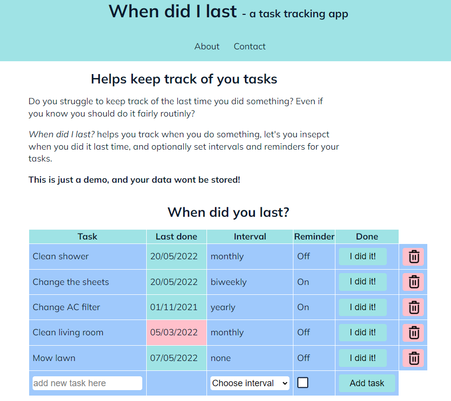

# When did I last? -a task tracking app

A low-pressure, low-maintenance task tracking app.

## Description

An app that keeps track on when you last did a spesific task.

The core of the app is just that, but you can also:

- Set an interval you want to keep for each task, or not.

## Built With

The app is built with just HTML/CSS and JS and needs a backend to function as something other than a demo. 

## Upcomming features

    - A backend to log in and store tasks and users.
    - Better styling and layout
    - Add categories
    - Filtering on categories
    - Filtering on due date
    - Delete task
    - Edit task
    

## Contributing

If you have anything you'd like to add to this project, make sure to open a pull request so code can be reviewed.

## Contact

[My Twitter page](https://twitter.com/MarenLilleberre)

[My LinkedIn page](https://www.linkedin.com/in/maren-lilleberre-117406188)

